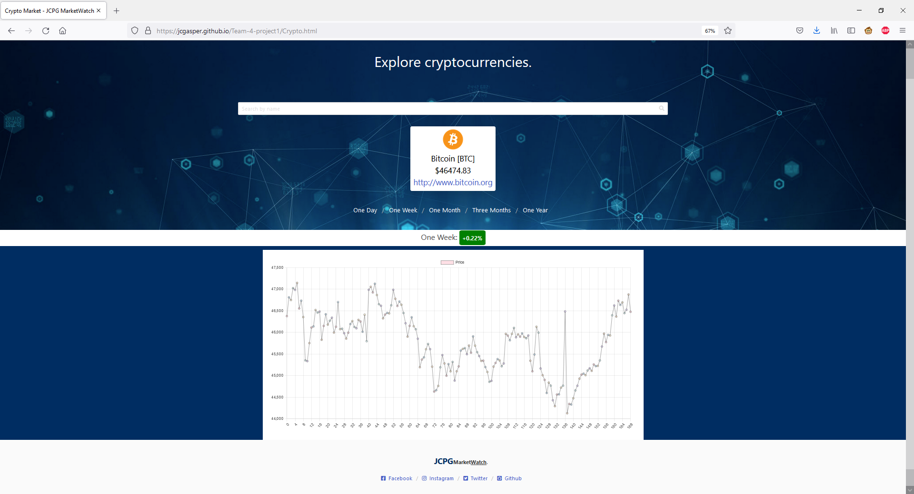

# JCPGMarketWatch

## Description
- JCPGMarketWatch is a collaborative project aiming to create one singular website for the average investor to be able to monitor the current market conditions of stocks and cryptocurrency

## Screenshots
- 
- 
- 
- 

## Libraries, APIs & Frameworks
- Bulma (CSS)
- ChartJS
- Fontawesome (CSS)
- CoinStats (API)
- MarketStack

## Contributors
- Jacob Gasper
- Greg Riveroll
- Phon Phongsavath
- Christian Tanicala

## Links
-
